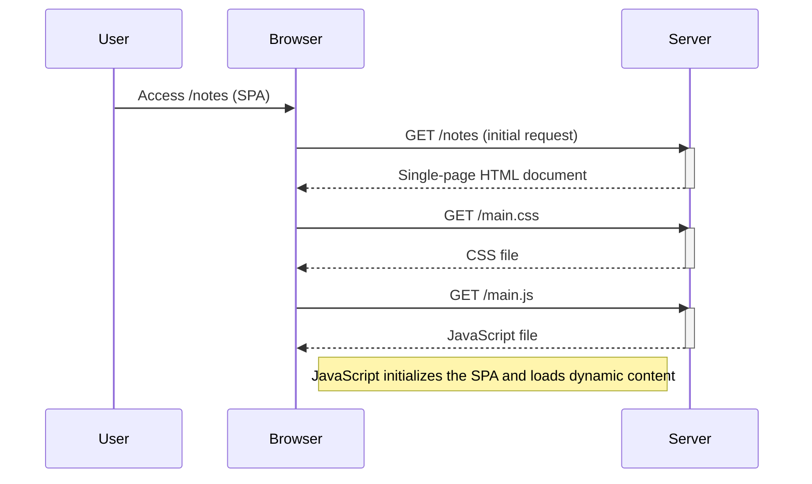

```mermaid
sequenceDiagram
    
    participant User
    participant Browser
    participant Server

    User->>Browser: Access /notes (SPA)
    Browser->>Server: GET /notes (initial request)
    activate Server
    Server-->>Browser: Single-page HTML document
    deactivate Server

    Browser->>Server: GET /main.css
    activate Server
    Server-->>Browser: CSS file
    deactivate Server

    Browser->>Server: GET /main.js
    activate Server
    Server-->>Browser: JavaScript file
    deactivate Server

    Note right of Browser: JavaScript initializes the SPA and loads dynamic content
``` 