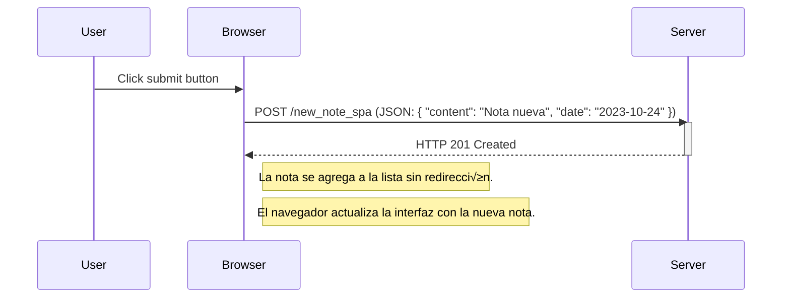

```mermaid
sequenceDiagram
    participant User
    participant Browser
    participant Server

    User->>Browser: Click submit button
    Browser->>Server: POST /new_note_spa (JSON: { "content": "Nota nueva", "date": "2023-10-24" })
    activate Server
    Server-->>Browser: HTTP 201 Created
    deactivate Server

    Note right of Browser: La nota se agrega a la lista sin redirección.

    Note right of Browser: El navegador actualiza la interfaz con la nueva nota.
```