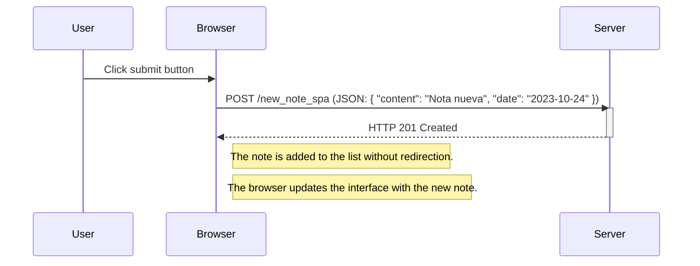

```mermaid
sequenceDiagram
    participant User
    participant Browser
    participant Server

    User->>Browser: Click submit button
    Browser->>Server: POST /new_note_spa (JSON: { "content": "Nota nueva", "date": "2023-10-24" })
    activate Server
    Server-->>Browser: HTTP 201 Created
    deactivate Server

    Note right of Browser: The note is added to the list without redirection.

    Note right of Browser: The browser updates the interface with the new note.
```