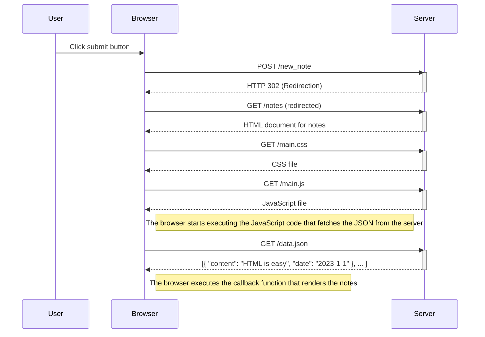

```mermaid
sequenceDiagram
    
    participant User
    participant Browser
    participant Server

    User->>Browser: Click submit button
    Browser->>Server: POST /new_note
    activate Server
    Server-->>Browser: HTTP 302 (Redirection)
    deactivate Server

    Browser->>Server: GET /notes (redirected)
    activate Server
    Server-->>Browser: HTML document for notes
    deactivate Server

    Browser->>Server: GET /main.css
    activate Server
    Server-->>Browser: CSS file
    deactivate Server

    Browser->>Server: GET /main.js
    activate Server
    Server-->>Browser: JavaScript file
    deactivate Server

    Note right of Browser: The browser starts executing the JavaScript code that fetches the JSON from the server

    Browser->>Server: GET /data.json
    activate Server
    Server-->>Browser: [{ "content": "HTML is easy", "date": "2023-1-1" }, ... ]
    deactivate Server

    Note right of Browser: The browser executes the callback function that renders the notes
```